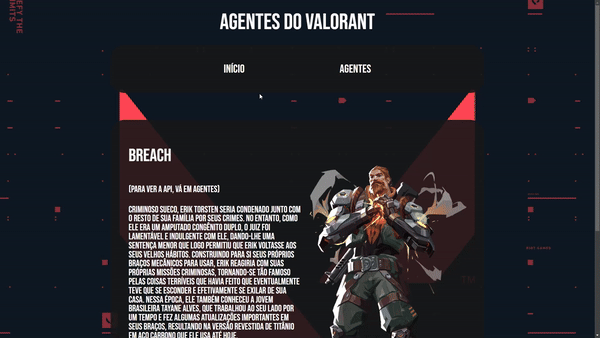
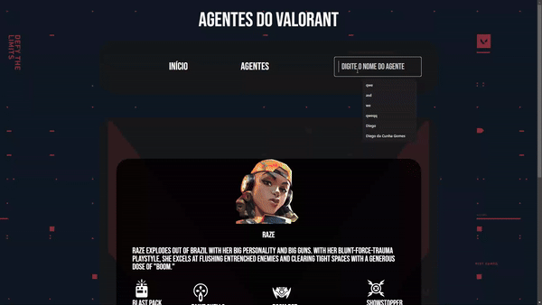

# WorkShop Front-END 2024.2

Esse projeto foi um desafio proposto pela Fábrica de Software - Unipê 2024.2

  

## Tecnologias Usadas

* HTML
* CSS
* React
* JavaScript
* Fetch
* SwiperJs(Carrousel)

## Carrossel (SwiperJS)

  

## Consumindo API

  

## Como executar:

* Clone este repositório.

### Instale as bibliotecas necessárias pelo terminal

*`npm install -g npm`
*`npm install react-router-dom`
* `npm install swiper`

### Inicie o projeto

* No terminal, digite `npm start` e abrirá uma página no navegador.

## Deploy
[Clique Aqui!](https://workshop-frontend-2024-2-eight.vercel.app/)

